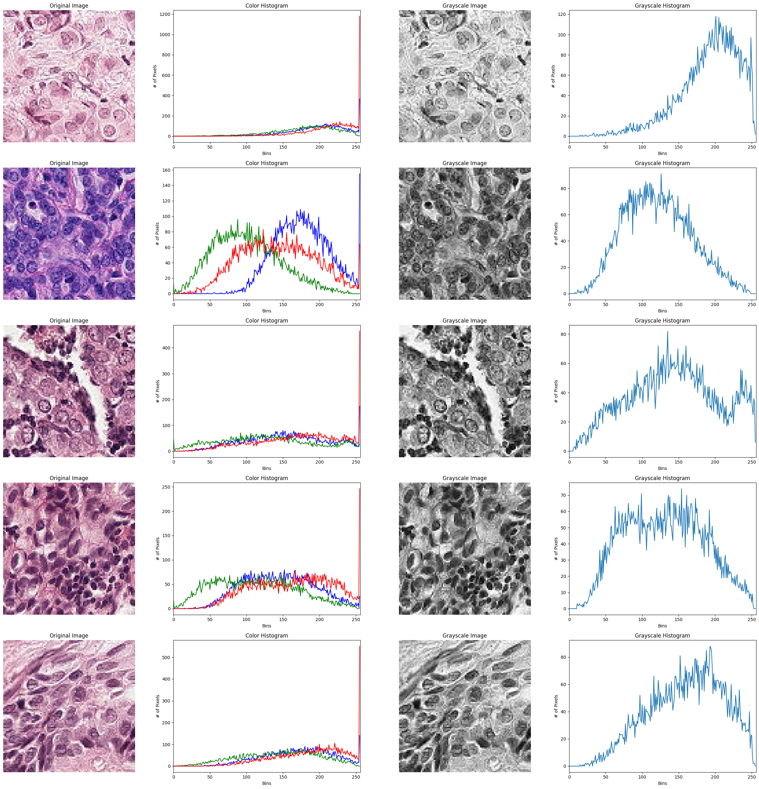
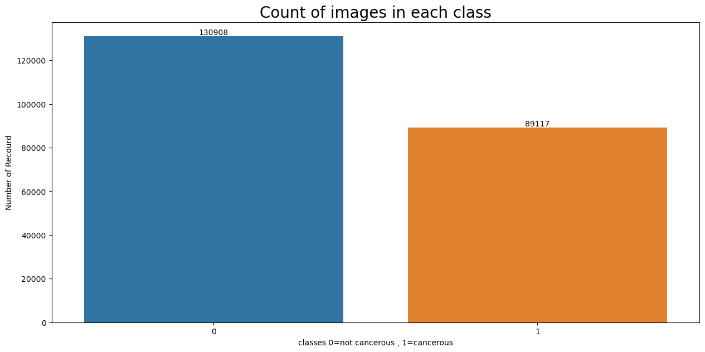
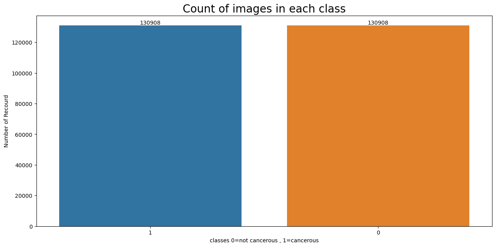
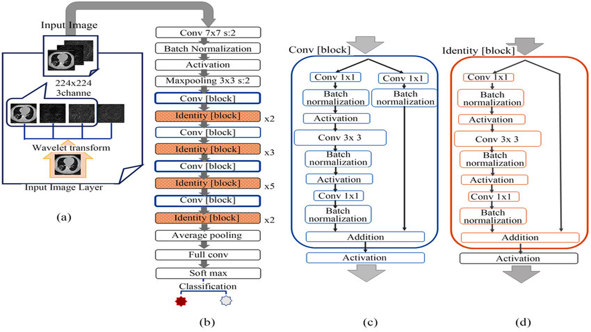
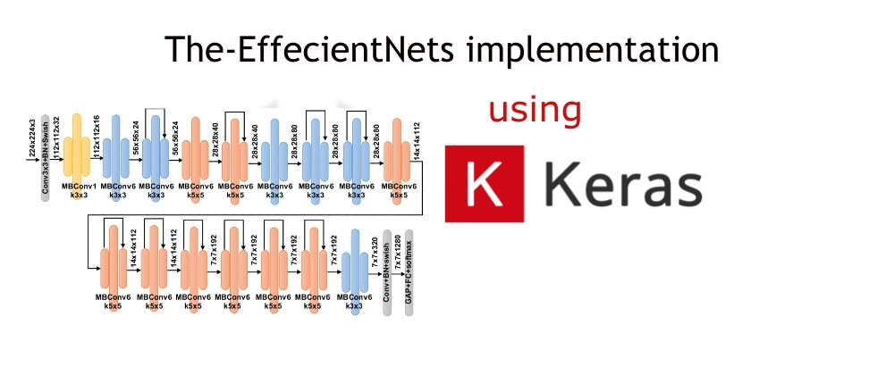

# Camelyon17 Breast Cancer Detection

## Overview

This project aims to develop a breast cancer detection model using the Camelyon17 dataset.
The dataset comprises histopathological images of breast cancer tissues,which we use to classify
the images into cancerous and non-cancerous categories. The project involves data exploration,
model design, training, evaluation, and deployment.

## 1. Prerequisites

To run this code, ensure that the following libraries are installed:

```bash
pip install -U efficientnet tensorflow numpy matplotlib pandas pillow scikit-learn
```

## 2. Data Loading and Exploration

The dataset used is the [Camelyon17](https://www.camelyon17.org/) dataset. We start by loading and visualizing the data to understand its structure and the distribution of classes.

### Code

```python
import tensorflow as tf
import numpy as np
import tensorflow.keras.layers as tfl
import matplotlib.pyplot as plt
import pandas as pd
from tensorflow.keras.models import Model
from tensorflow.keras.initializers import random_uniform, glorot_uniform
import efficientnet.tfkeras as efn
from tensorflow.keras.models import Sequential
from tensorflow.keras.layers import * 
import os
import shutil
import json
from PIL import Image
```

**Data Loading Function**

```python
def train_img_path(id_str):
    return os.path.join(r"/kaggle/input/histopathologic-cancer-detection/train", f"{id_str}.tif")
```

### Exploratory Data Analysis

We explore a sample image and display a few examples of both cancerous and non-cancerous images.

```python
example_path = "/kaggle/input/histopathologic-cancer-detection/train/f38a6374c348f90b587e046aac6079959adf3835.tif"
example_img = Image.open(example_path)
example_array = np.array(example_img)
print(f"Image Shape = {example_array.shape}")
plt.imshow(example_img)
plt.show()
```

## 3. Image Display and Histogram Analysis.

This script samples non-cancerous images from a dataset,
displays them, and plots their corresponding color and grayscale histograms.

## How It Works
1. **Sample Non-Cancerous/Cancerous  Images:**
   The script randomly selects 5 filenames of non-cancerous/Cancerous images from a dataframe `train_labels_df` where the label is '0' (non-cancerous) and '1' for (Cancerous).


2. **Set Up Plot:**
   A figure with subplots is created. The number of rows corresponds to the number of sampled images, and each row contains 4 columns.

 
3. **Process and Display Each Image:**
   - The script reads each image in color and converts it to grayscale.
   - The color image is split into its blue, green, and red channels.


4. **Display Original Image:**
   The original color image is displayed in the first column of the subplot row.


5. **Plot Color Histograms:**
   Histograms for each color channel are calculated and plotted in the second column of the subplot row.


6. **Display Grayscale Image:**
   The grayscale image is displayed in the third column of the subplot row.


7. **Plot Grayscale Histogram:**
   A histogram for the grayscale image is calculated and plotted in the fourth column of the subplot row.


8. **Final Layout and Display:**
   The layout is adjusted to prevent overlap, and the plot is displayed.


## Code

```python
import numpy as np
import matplotlib.pyplot as plt
import cv2

# Sample filenames from the dataframe 

# This Sample For Non-Cancerous Images
images = np.random.choice(train_labels_df[train_labels_df['label'] == '0']['filename'], 5)

# This Sample For Cancerous Images
images = np.random.choice(train_labels_df[train_labels_df['label'] == '1']['filename'], 5)

print("Non-Cancerous Images")
# Set up the figure and subplots
fig, axs = plt.subplots(len(images), 4, figsize=(25, 5 * len(images)))

for i, image_path in enumerate(images):
    color_image = cv2.imread(image_path)
    gray_image = cv2.cvtColor(color_image, cv2.COLOR_BGR2GRAY)

    # Split the image into its color channels
    channels = cv2.split(color_image)
    colors = ('b', 'g', 'r')
    channel_ids = (0, 1, 2)

    # Original Image
    axs[i, 0].imshow(cv2.cvtColor(color_image, cv2.COLOR_BGR2RGB))
    axs[i, 0].set_title("Original Image")
    axs[i, 0].axis('off')

    # Plot histograms for each color channel
    axs[i, 1].set_title("Color Histogram")
    axs[i, 1].set_xlabel("Bins")
    axs[i, 1].set_ylabel("# of Pixels")
    for (channel, color, channel_id) in zip(channels, colors, channel_ids):
        hist = cv2.calcHist([channel], [0], None, [256], [0, 256])
        axs[i, 1].plot(hist, color=color)
        axs[i, 1].set_xlim([0, 256])

    # Grayscale Image
    axs[i, 2].imshow(gray_image, cmap='gray')
    axs[i, 2].set_title("Grayscale Image")
    axs[i, 2].axis('off')

    # Grayscale Histogram
    gray_hist = cv2.calcHist([gray_image], [0], None, [256], [0, 256])
    axs[i, 3].set_title("Grayscale Histogram")
    axs[i, 3].set_xlabel("Bins")
    axs[i, 3].set_ylabel("# of Pixels")
    axs[i, 3].plot(gray_hist)
    axs[i, 3].set_xlim([0, 256])

plt.tight_layout()
plt.show()
```


## 4. Apply Over Sampling.
Oversampling is a technique used to address class imbalance by increasing the number of instances in the minority class. Here, we can apply random oversampling to create a more balanced dataset by duplicating samples from the minority class (Class 1) to match the number of samples in the majority class (Class 0).

### Steps for Random Oversampling

1. **Identify the Imbalance:**
   - Class 0 (Non-Cancerous): 130,908 images
   - Class 1 (Cancerous): 89,117 images

2. **Calculate the Number of Samples Needed:**
   - To balance the classes, we need to increase the number of Class 1 samples to match Class 0.
   - Additional samples needed for Class 1: \(130,908 - 89,117 = 41,791\)

3. **Randomly Sample from Class 1:**
   - Randomly select samples from Class 1 with replacement until the class size matches Class 0.

### Before Over Sampling


### After Over Sampling


## 3. Model Design

We designed a custom ResNet50 model, leveraging the strengths of residual networks to address the image classification task. We also experimented with EfficientNetB0 and Vision Transformers (ViT) to compare performance.

### Custom ResNet50 Implementation

```python
def identity_block(X, f, filters, training=True, initializer=random_uniform):
    # Implementation details...
    return X

def convolutional_block(X, f, filters, s=2, training=True, initializer=glorot_uniform):
    # Implementation details...
    return X

def ResNet50(input_shape=(96, 96, 3)):
    # Implementation details...
    return model
```

### EfficientNetB0 Implementation

```python
import efficientnet.tfkeras as efn

base_model = efn.EfficientNetB0(input_shape=(96,96,3), include_top=False, weights='imagenet')
cnn = Sequential([
    base_model,
    Flatten(),
    Dense(64, activation='relu'),
    Dropout(0.5),
    Dense(32, activation='relu'),
    Dropout(0.5),
    BatchNormalization(),
    Dense(1, activation='sigmoid')
])
```

### Vision Transformer (ViT) Implementation

```python
from transformers import ViTForImageClassification, ViTokenizer
# Implementation details...
```

## 4. Model Training and Evaluation

### Training

We train the models using the Adam optimizer and binary cross-entropy loss.

```python
model.compile(optimizer=tf.keras.optimizers.Adam(learning_rate=0.001),
              loss=tf.keras.losses.BinaryCrossentropy(from_logits=True),
              metrics=['accuracy', tf.keras.metrics.AUC()])

history = model.fit(
    train_generator,
    steps_per_epoch=train_steps,
    validation_data=validation_generator,
    validation_steps=val_steps,
    epochs=10
)
```

### Evaluation

Evaluation metrics include accuracy, precision, recall, F1 score, and ROC-AUC. Since the test labels are not available, evaluation is conducted on the validation set.

```python
from sklearn.metrics import accuracy_score, precision_score, recall_score, f1_score, roc_auc_score

val_predictions = tf.nn.sigmoid(model.predict(validation_generator)).numpy()
val_pred_classes = (val_predictions > 0.5).astype(int).flatten()
true_labels = validation_generator.classes

accuracy = accuracy_score(true_labels, val_pred_classes)
precision = precision_score(true_labels, val_pred_classes)
recall = recall_score(true_labels, val_pred_classes)
f1 = f1_score(true_labels, val_pred_classes)
roc_auc = roc_auc_score(true_labels, val_predictions)

print(f"Accuracy: {accuracy:.4f}")
print(f"Precision: {precision:.4f}")
print(f"Recall: {recall:.4f}")
print(f"F1 Score: {f1:.4f}")
print(f"ROC-AUC: {roc_auc:.4f}")
```

### Results

Below are the training and validation metrics for ResNet and EfficientNetB0.

#### ResNet Metrics



#### EfficientNetB0 Metrics




## 5. References

1. **ResNet**: He, K., Zhang, X., Ren, S., & Sun, J. (2016). Deep Residual Learning for Image Recognition. *In Proceedings of the IEEE Conference on Computer Vision and Pattern Recognition (CVPR)*. [Link](https://arxiv.org/abs/1512.03385)
2. **EfficientNet**: Tan, M., & Le, Q. V. (2019). EfficientNet: Rethinking Model Scaling for Convolutional Neural Networks. *In Proceedings of the IEEE Conference on Computer Vision and Pattern Recognition (CVPR)*. [Link](https://arxiv.org/abs/1905.11946)
3. **Vision Transformer**: Dosovitskiy, A., Beyer, L., Kolesnikov, A., Weissenborn, D., Zhai, X., & others (2021). An Image is Worth 16x16 Words: Transformers for Image Recognition at Scale. *In Proceedings of the International Conference on Learning Representations (ICLR)*. [Link](https://arxiv.org/abs/2010.11929)
